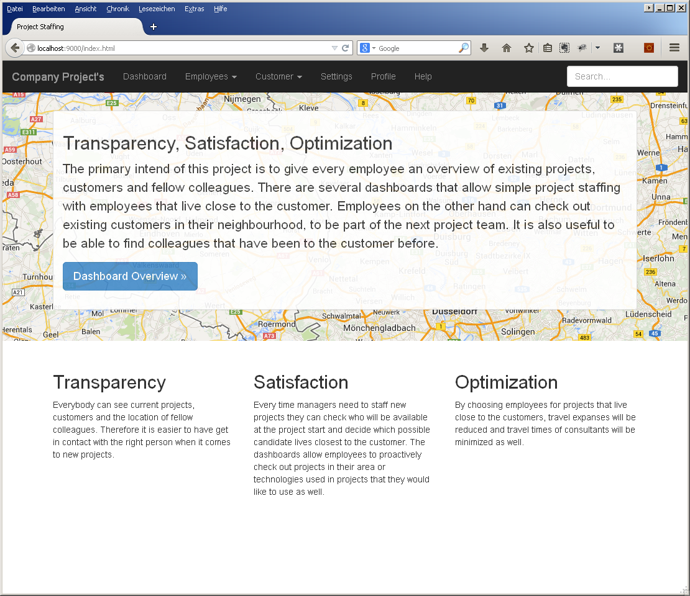
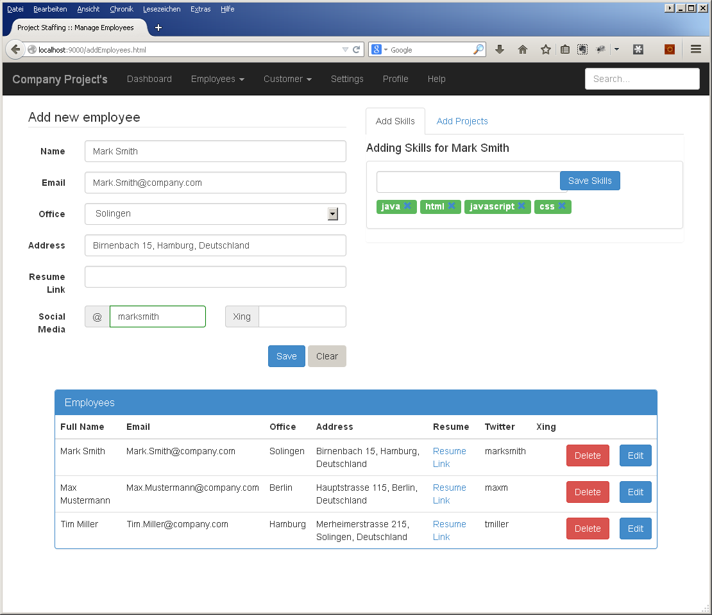
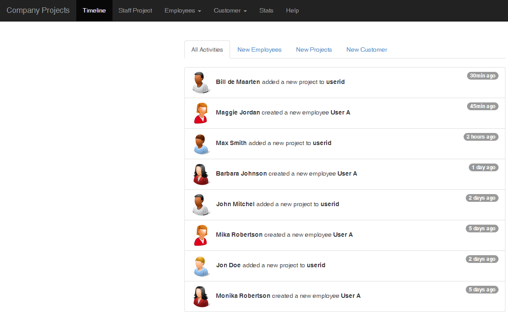

# Documentation

This application will help you to manage customers, employees and staff projects.
On the staffing page you can search a customer address and find employees that are a good match for the customer:

- employee has certain skills for project
- employee lives close to the customer
- employees current project is running or has already run out

# Screenshots

Here are a couple of screenshots what the app looks like

# ER Diagram

I used https://www.draw.io/ for the ER diagram that you will find under the /help page. 
You can simply import the XML files in draw.io to make changes

- project-staffing-er-diagram.xml